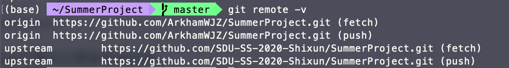
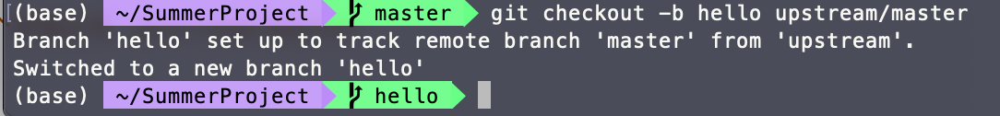
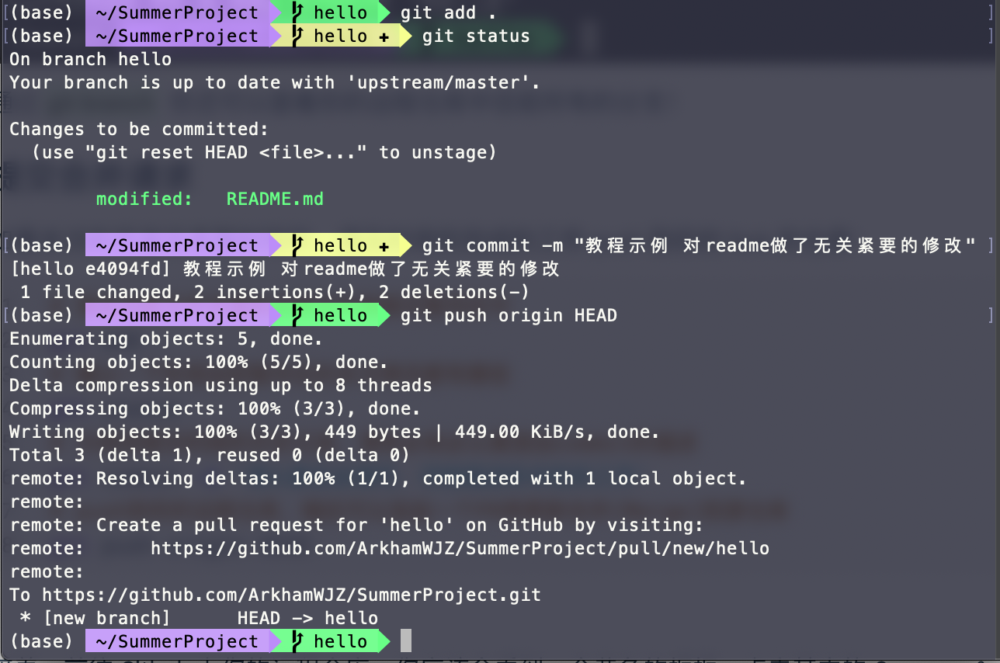
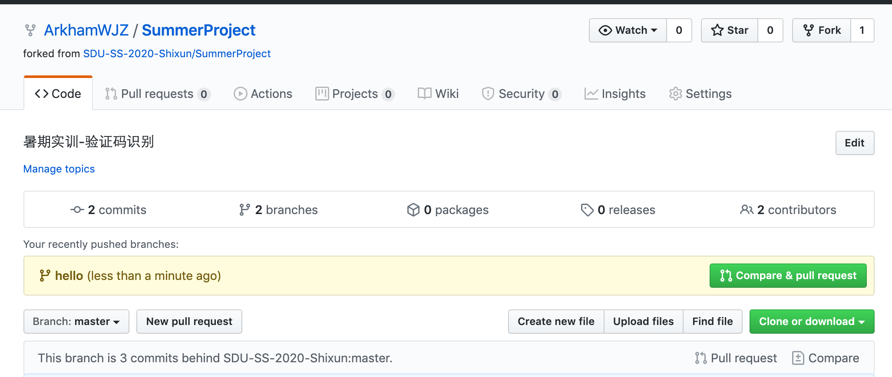
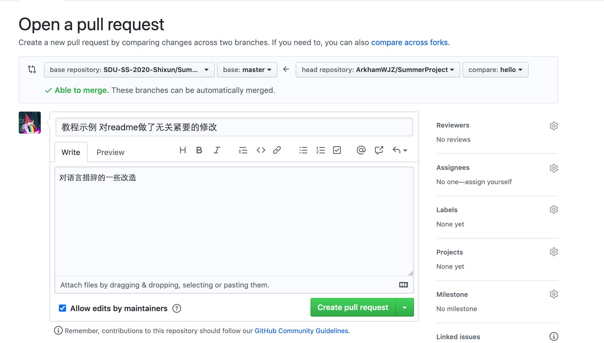
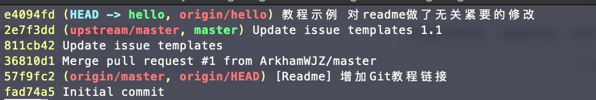

### 如果你是第一次

1. 你需要准备以下工具

   * 注册 GitHub 账号

   * Git   [百度网盘链接](https://pan.baidu.com/s/1syhWtmTL-vBz4NeMMWuPsw)  密码:pm3p

     - 安装完毕 Git 后，在终端使用以下两条命令进行全局配置：

     - ```bash
       git config --global user.name "你的用户名"
       git config --global user.email "你的邮箱"
       
       # 此用户名和邮箱是 git 提交代码时用来显示你身份和联系方式
       # 并不一定要求是注册 github 的用户名和邮箱
       ```

2. Fork本仓库（点击右上角的 fork 按钮，~~顺便也可以按下Star~~）

   > 这会在你的 GitHub 仓库下创建一个一模一样的远程仓库（与源仓库独立）
   >
   > 建立概念：源仓库 ～ 远程仓库 ～  本地仓库

3. 在控制台执行下列命令：

   ```bash
   # 将你的远程仓库克隆到本地
   git clone https://github.com/你的用户名/SummerProject.git --depth=1 
   cd SummerProject
   # 添加源仓库为上游
   git remote add upstream https://github.com/SDU-SS-2020-Shixun/SummerProject.git
   ```
   
   此时你可以通过 ==git remote -v== 查看是否添加上游仓库成功：
   
   

### 开发前准备

**在每次准备开发之前** ==请务必不要忘记更新本地仓库==：

```bash
# 从上游仓库取回更新，并存储在一个本地分支 upstream/master 
git fetch upstream
# 合并更新
git merge upstream/master
```

这样就完成了本地仓库与源仓库的同步，并且不会丢掉本地修改的内容。

如果你想新建分支的话，可以通过如下操作，新建一个名为hello的分支到你的远程仓库（分支名称最好与你的工作相关）

> git checkout -b hello upstream/master

可以看到新建之后，我们从默认的master分支，切换到了hello分支



通过==git branch== 你还可以查看你的远程仓库中目前所有的分支！

### 提交合并请求

如果本次的开发任务暂时完毕，请及时将你完成的工作 push 到你的 fork 的仓库：

```bash
# 添加当前文件夹里的全部文件到提交暂存区中
git add .
# 确认一下你添加到暂存区的本次修改都有哪些
git status   
# 为保持提交的线形历史记录，请务必务必认真添加commit的描述
git commit -m "请认真在此填写，详细描述你本轮的工作"
# push到你的远程仓库，随后可以发起一个PR将更新合并(Merge)到源仓库
git push origin HEAD
```



接着，前往 Github 上你的远程仓库。你应该会看到一个黄色的框框，点击其中的 Compare & pull request 按钮。填写说明，点击 Create pull request 按钮，这样就发起合并请求了，（或者通过 New pull request 按钮，由你的远程仓库相应分支向源仓库 Master 分支发起一次PR）。





稍后管理员会进行审核，如果没问题，就会合并进源仓库。

## 注意

如果你在每次开发过程中，严守开发规范，上述教程应该是足够使用了；但了解更多有用的 git 指令确实会让你的在版本管理过程中掌控雷电。

1、==git log --oneline== 大略的显示commit的线形历史记录，输出应该如下所示：



左侧的是每次commit生成的哈希码标识，这在版本回滚之类的操作时会非常有用！你也许也注意到了右侧的commit注释有些杂乱无章，中英文混杂，格式也没有统一。希望这能有所警示，协商好一种优美的commit记录写法会让后续的管理心情愉悦很多！

2、在一次commit之后要是突然发现要更改几行代码做出补充怎么办？这是一次新的commit记录好像是 有些小题大做令人无法接受。重新add之后通过==git commit --amend==完美解决你的问题，它会在对上次commit作出补充提交，并不会产生新的记录。

3、暂存区管理。上文我们提到了通过==git status==查看加入到暂存区中的修改文件 ，相应的我们可以使用==git reset HEAD 完整的文件名== 移除那些我们不想提交的文件。

4、版本回滚怎么操作？如果进过一通神妙的操作让你的项目乱七八糟，你也许想回滚到之前的某个版本。按照这个[教程](https://blog.csdn.net/yxlshk/article/details/79944535)进行操作，他表述的要比我生动详尽很多，希望这能帮到你！

